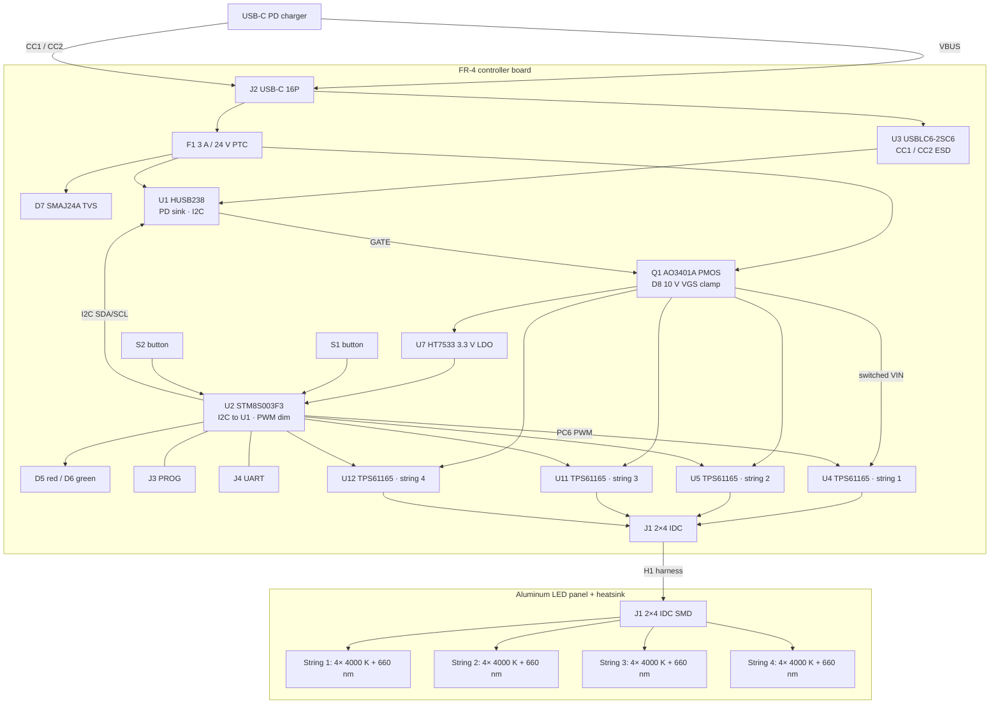

# 20 W USB-C PD Grow Light — System Plan

As-built from the KiCad schematics (main board `grow-light.kicad_sch` +
`led_driver.kicad_sch`, LED panel `grow-light-LEDS.kicad_sch`). Two
assemblies: an FR-4 controller board and a one-layer aluminum LED panel,
joined by an 8-wire LED harness on 2×4 IDC headers. USB-C input is the
power source. An STM8 MCU requests the PD contract over I2C and PWM-dims
four independent TPS61165 boost LED drivers.

## Block diagram

## Power path

1. USB-C **J2** VBUS through **F1** (3 A hold / 24 V PTC, C7500481) and
   **D7** (SMAJ24A). **U3** protects CC1/CC2 only.
2. **U1** (HUSB238) drives **Q1** (AO3401A) after a PD contract. **D8**
   (BZX84C10) clamps Q1 VGS. **R1** (10 Ω) is the GATE series resistor.
3. Switched VIN feeds four **TPS61165DRV** boost LED drivers and **U7**
   (HT7533, 3.3 V / 100 mA) for the MCU.
4. TPS61165 VIN is 3–18 V. Firmware on **U2** must request a PDO of
   **9 V or 12 V** (not 20 V). A 15.8 V LED string needs boost headroom
   below that voltage.

## Control path

- **U2** STM8S003F3 (TSSOP-20) talks to U1 over I2C (`SDA` / `SCL`) and
  PWM-dims all four driver CTRL pins from `PC6`.
- **S1** (`PD3`) and **S2** (`PD4`) are on-board tactile buttons.
  **D5** (red) and **D6** (green) are 0805 status LEDs.
- **J3** is SWIM/NRST programming. **J4** is UART (`PD5` TX / `PD6` RX).
- There is no panel-mount power switch or dimmer pot. On/off and dimming
  are MCU functions.

## LED drive (per string)

Each hierarchical `led_driver` sheet is one boost channel:

| Item | Schematic |
|---|---|
| Driver | TPS61165DRV, WSON-6-EP, 1.2 MHz, 200 mV FB |
| Inductor | L1–L4 22 µH CENKER CKCS4030, LCSC **C354592**, 4×4×3.0 mm, 1.0 A / 1.3 A sat |
| Freewheel | D1–D4 B5819WS Schottky 40 V / 1 A, SOD-323, **C7420331** |
| Current sense | R4–R7 820 mΩ 1206, **C2907361** → ILED ≈ 200 mV / 0.82 Ω ≈ **0.244 A** |
| VIN cap | C2–C5 4.7 µF 25 V X5R 0805, **C1779** |
| Output cap | C8–C11 1 µF 50 V X5R 0603, **C15849** |
| COMP | C19–C22 220 nF 25 V X7R 0603, **C21120** |

Driver references on the root sheet: **U4, U5, U11, U12**.

## LED panel

Four electrically independent strings. Each string is four 4000 K whites
plus one 660 nm red in series (~15.8 V at 0.244 A ≈ 3.85 W).

| LEDs | Designators | Footprint |
|---|---|---|
| 16 × 4000 K white | D1–D4, D6, D7, D9–D12, D14–D17, D19, D20 | 3030 |
| 4 × 660 nm red | D5, D8, D13, D18 | 3535-3P |
| J1 | 2×4 IDC SMD | to main-board J1 |

The LED schematic does not carry LCSC fields. Previously qualified parts
are Cree `C17398997` (white) and Silverlight `C2833507` (red).

## Power budget (nominal)

| Item | Value |
|---|---|
| PD request | 9 V or 12 V PDO (TPS61165 VIN ≤ 18 V); product still ~20 W class |
| Per string | 4 × 3.2 V white + 3.0 V red ≈ 15.8 V at 0.244 A ≈ 3.85 W |
| Four strings | ≈ 15.4 W LED load |
| Input current | ~1.7 A at 9 V or ~1.3 A at 12 V (plus boost/LDO overhead) |

## Open electrical notes

- Inductor selected: **C354592** CKCS4030 4×4×3.0 mm, 22 µH, 1.0 A Irms /
  1.3 A sat, 225 mΩ. Peak inductor current is ~0.5 A at 9 V VIN, ~0.83 A
  at 5 V. Footprint `Inductor_SMD:L_Cenker_CKCS4030` is already in KiCad
  10. Apply on the `led_driver` sheet (L1–L4 share one symbol) then
  Update PCB from Schematic.
- **R2** 49.9 kΩ and **R3** 5.1 kΩ are the HUSB238 VSET/ISET typical-app
  pair. 5.1 kΩ ISET is about 1.5 A. 49.9 kΩ is not a datasheet VSET tap;
  do not let the default contract land on 20 V.
- TPS61165 VIN capacitors are 25 V parts. Fine at 9/12 V; not a 20 V
  design.
